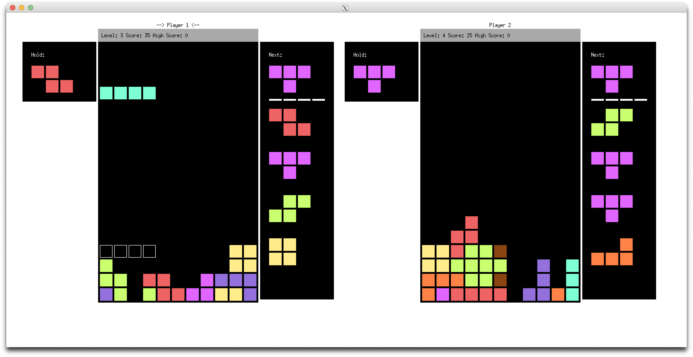

# BiQuadris: 1v1 Tetris Game

## Overview

Biquadris is a 1v1 Tetris variant developed in C++ with XWindow graphics, leveraging good Object-Oriented Programming (OOP) design principles. This project served as the final assignment for my University of Waterloo CS course (CS 246), where I achieved a final grade of 110%.

This repo provides a high level overview of the project; the full codebase is not provided in this repo due UWaterloo's academic integrity policy. 

The game supports two-player competitive gameplay with a console-based view (ConsoleView) and an optional GUI view (GraphicsView) using the Xwindow library. 

 

The game code is designed with a focus on modularity, maintainability, and flexibility.

## Key Features
- Two-player competitive gameplay.
- Multiple display modes: ConsoleView (text-based) and GraphicsView (GUI).
- Various block types, custom levels, and special effects (e.g., heavy, blind).
- Efficient command parsing and customizable commands with macros.
- Support for custom levels, blocks, and game rules with minimal code changes.
- Scoring and line-clearing logic that is resilient and performant.
- Enhanced resilience to change with a highly modular structure.

## Design Principles
- Decoupling and High Cohesion: Modules are separated into logical directories, such as BiquadrisGame, CommandTree, and Displays. Each module is responsible for a specific aspect of the game, reducing interdependencies and increasing maintainability.
- Encapsulation: Core game logic is encapsulated within the Biquadris class and further protected with Proxy classes (e.g., DisplayProxy) to prevent unintended access.
- Modularity: Game components, including blocks, levels, commands, and effects, are designed with interfaces and abstract classes, making it easy to extend and modify the game.

## Design Patterns
- Façade Pattern: The Biquadris class provides a unified interface for managing game logic, encapsulating subsystems like Board, Effect, and Level.
- Protection Proxy Pattern: Proxy classes restrict external access to specific subsets of game functionality, improving security and maintainability.
- Factory Method and NVI Idiom: These are used for creating blocks, levels, and effects, ensuring DRY (Don’t Repeat Yourself) principles and flexibility in object creation.
- Subject-Observer Pattern: DisplayObserver (base class for ConsoleView and GraphicsView) is attached to Biquadris, updating the display whenever the game state changes.
- Command Pattern: Commands are encapsulated in Command classes with a CommandTree for efficient parsing, enabling customizable commands and macros.
